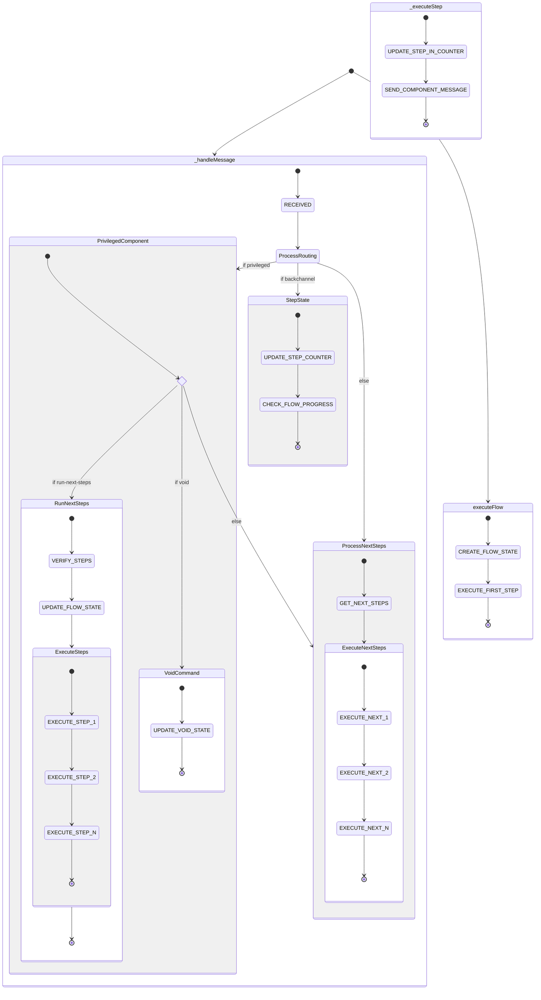

# Idempotent State Machine Implementation

## Problem Statement

The ComponentOrchestrator needed to handle message processing and flow execution in a way that:
1. Is idempotent (can safely retry operations)
2. Can resume from failures
3. Maintains atomic operations
4. Tracks execution state
5. Cleans up old execution data

## Evolution of the Solution

### Initial State Diagram
The system was first visualized as a state machine with two main entry points:


### Key Insights and Improvements

1. **State Tracking**
   - Only track write operations
   - Read operations should always be fresh
   - Each step execution needs individual tracking
   - Atomic operations must be tracked separately

2. **MongoDB Schema**
   ```javascript
   const schema = new Schema({
       executionId: { type: String, unique: true, required: true, index: true },
       flowExecId: { type: String, required: true, index: true },
       currentState: { type: String, required: true },
       stepExecutions: [{
           stepId: { type: String, required: true },
           counterUpdated: { type: Boolean, default: false },
           messageSent: { type: Boolean, default: false },
           completedAt: { type: Date },
           error: Schema.Types.Mixed
       }],
       stateHistory: [{
           state: { type: String, required: true },
           startedAt: { type: Date, required: true },
           completedAt: { type: Date },
           error: Schema.Types.Mixed
       }],
       inputMessage: Schema.Types.Mixed,
       isCompleted: { type: Boolean, default: false },
       completedAt: { type: Date, expires: '7d' }
   });
   ```

3. **State Machine Executor**
   The StateMachineExecutor class encapsulates all state management logic:
   ```javascript
   class StateMachineExecutor {
       async executeState({ executionId, state, work, context }) {
           // Check if already completed
           // Track state transition
           // Execute work
           // Mark completion
       }

       async executeStep({ executionId, stepId, updateCounter, sendMessage, context }) {
           // Track atomic operations separately
           // Ensure idempotency for each operation
           // Handle errors properly
       }
   }
   ```

4. **Usage Pattern**
   ```javascript
   await stateMachine.executeState({
       executionId,
       state: 'SOME_STATE',
       work: async (context) => {
           // Business logic here
       },
       context: { /* context data */ }
   });
   ```

## Key Benefits

1. **Idempotency**
   - Each state transition is tracked
   - Atomic operations are tracked individually
   - Safe to retry at any point

2. **Error Recovery**
   - Clear error states
   - Can resume from last successful state
   - Errors are tracked per operation

3. **Clean Architecture**
   - Business logic separated from state tracking
   - Consistent error handling
   - Reusable state machine pattern

4. **Data Cleanup**
   - TTL index removes old executions
   - Completed executions expire after 7 days
   - Maintains database efficiency

## Implementation Details

### State Tracking
- Each execution has a unique ID (`executionId`) and flow execution ID (`flowExecId`)
- States are tracked chronologically in `stateHistory` array
- Each state entry contains:
  - state name
  - startedAt timestamp
  - completedAt timestamp (when finished)
  - error details (if failed)
- Step executions track atomic operations with:
  - stepId
  - counterUpdated flag
  - messageSent flag
  - completedAt timestamp
  - error details

### Error Handling
- Errors are tracked at both state and step level
- Failed states prevent progression but allow retry
- Error details are preserved with timestamps
- Clean error recovery path through state resume
- Step-level errors don't affect other steps
- Atomic operation tracking enables partial recovery

### Atomic Operations
- Counter updates and message sending are separate tracked operations
- Each operation has its own completion flag
- Operations can be safely retried through idempotency checks
- Prevents duplicate messages/updates through state verification
- Maintains operation order through stepExecutions array

### Testing Strategy
1. **Unit Tests**
   - Individual state transitions
   - Step execution tracking
   - Error handling scenarios
   - Atomic operation verification
   - Concurrent operation handling

2. **Integration Tests**
   - Full execution flows
   - State machine interactions
   - Database operations
   - Error recovery scenarios

3. **Performance Tests**
   - Concurrent execution handling
   - High-volume state transitions
   - Database index efficiency
   - Cleanup operation impact

## Best Practices

1. **State Design**
   - Keep states granular and well-defined
   - Track atomic operations separately
   - Use meaningful state names
   - Include context in state transitions
   - Maintain state history for debugging

2. **Error Handling**
   - Track errors with full context
   - Implement retry mechanisms
   - Provide clean recovery paths
   - Maintain error history
   - Separate step and state errors

3. **Performance**
   - Use appropriate MongoDB indexes
   - Implement TTL cleanup (7-day retention)
   - Batch operations when possible
   - Track only necessary state
   - Use optimistic locking for concurrent updates

4. **Monitoring**
   - Log state transitions
   - Track execution times
   - Monitor error rates
   - Alert on stuck states
   - Track atomic operation completion

## Schema Design

```javascript
const schema = new Schema({
    // Unique identifier for this execution
    executionId: {
        type: String,
        unique: true,
        required: true,
        index: true
    },
    // Reference to flow execution
    flowExecId: {
        type: String,
        required: true,
        index: true
    },
    // Current state in the state machine
    currentState: {
        type: String,
        required: true
    },
    // Track individual step executions
    stepExecutions: [{
        stepId: {
            type: String,
            required: true
        },
        counterUpdated: {
            type: Boolean,
            default: false
        },
        messageSent: {
            type: Boolean,
            default: false
        },
        completedAt: {
            type: Date
        },
        error: Schema.Types.Mixed
    }],
    // States that have been started with their completion status
    stateHistory: [{
        state: {
            type: String,
            required: true
        },
        startedAt: {
            type: Date,
            required: true
        },
        completedAt: {
            type: Date
        },
        error: Schema.Types.Mixed
    }],
    // Input message that triggered this execution
    inputMessage: Schema.Types.Mixed,
    // Overall execution status
    isCompleted: {
        type: Boolean,
        default: false
    },
    // When the execution was completed
    completedAt: {
        type: Date,
        expires: '7d' // TTL index: Remove document 7 days after completion
    }
}, {
    timestamps: true
});

// Important indexes
schema.index({ flowExecId: 1, currentState: 1 });
schema.index({ completedAt: 1 }, { expireAfterSeconds: 7 * 24 * 60 * 60 });
schema.index({ 'stepExecutions.stepId': 1 });
```

## Future Improvements

1. **State Machine Visualization**
   - Real-time state diagram
   - Execution path visualization
   - Error state highlighting
   - Performance metrics
   - Atomic operation status display

2. **Enhanced Recovery**
   - Automatic retry strategies with backoff
   - Partial state recovery for atomic operations
   - Branching recovery paths based on error type
   - Recovery prioritization by error severity
   - Bulk operation recovery

3. **Performance Optimization**
   - Batch state updates
   - Optimistic locking for concurrent operations
   - Caching strategies for state lookups
   - Index optimization for common queries
   - Archival strategy for old executions

4. **Known Issues and Fixes**
   - Message ID uniqueness: Need to incorporate RabbitMQ message ID
   - Concurrent execution handling improvements
   - Better cleanup of orphaned states
   - Enhanced error context preservation
   - Improved monitoring capabilities

## Testing Considerations

1. **Unit Test Coverage**
   - State transitions
   - Step execution tracking
   - Error handling
   - Atomic operations
   - Concurrent operations

2. **Integration Testing**
   - Full flow execution
   - Error recovery
   - Database operations
   - Message handling
   - Cleanup processes

3. **Performance Testing**
   - Concurrent execution
   - High volume operations
   - Database efficiency
   - Cleanup impact
   - Resource utilization